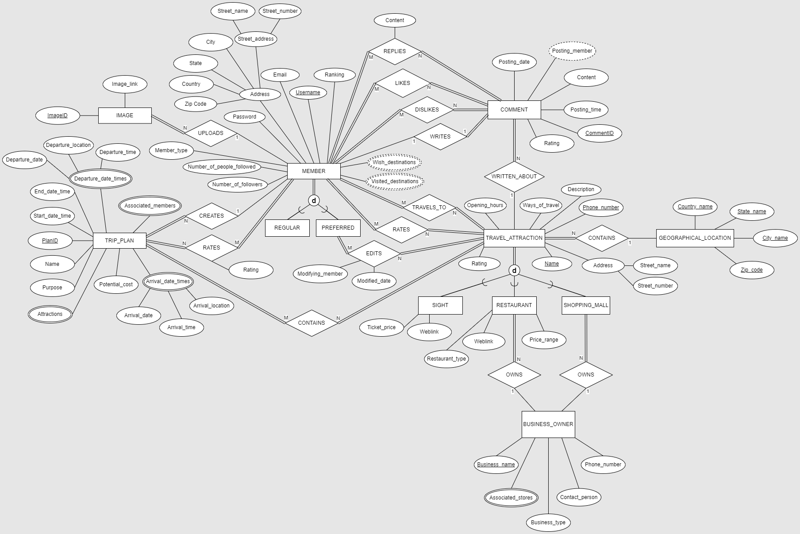
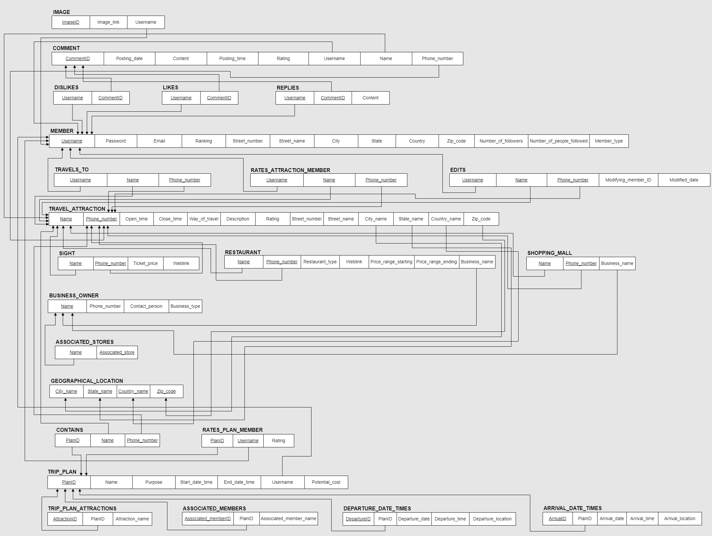
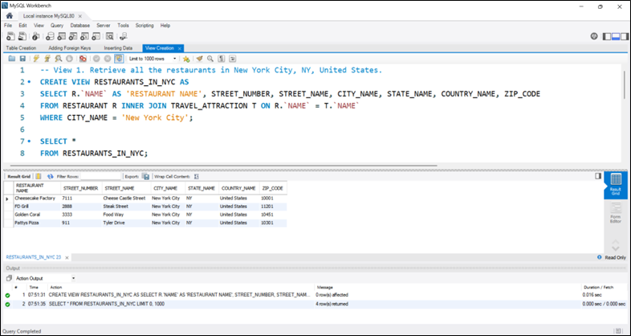
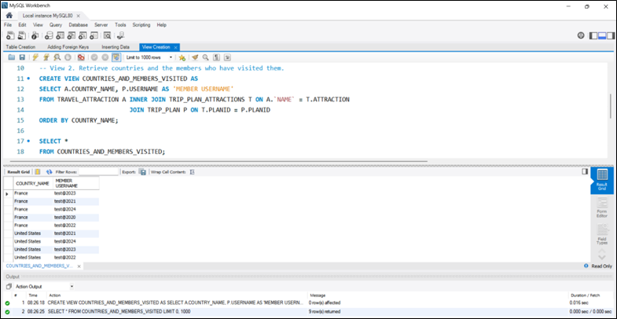
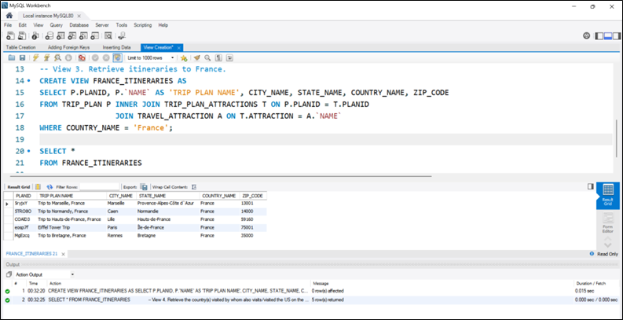
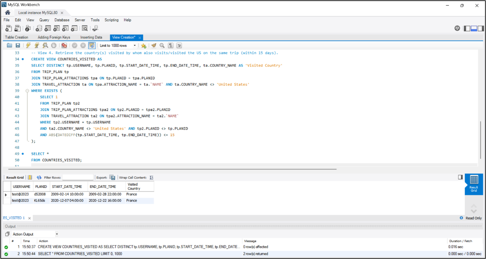

# 🧳 Travel Itinerary Management Database

This project is a relational travel itinerary database built in MySQL Workbench. It models users, trip plans, attractions, and reviews using a fully normalized schema with foreign keys, entity-relationship diagrams, and advanced SQL queries.

---

## 📐 ER Design & Structure

- Designed an Enhanced ER (EER) model to capture core relationships between users, destinations, trip plans, and travel attractions.
- Transformed the EER diagram into a normalized relational schema with primary keys, foreign keys, and associative tables.

---

## 🛠️ Technologies Used

- **Database**: MySQL Workbench
- **Language**: SQL
- **Tools**: ER Modeling, Relational Design, Views, Joins, Aggregation

---

## 📁 Project Files

| File | Purpose |
|------|---------|
| `Table Creation.sql` | Defines all relational tables |
| `Adding Foreign Keys.sql` | Adds constraints to enforce data integrity |
| `Inserting Data.sql` | Populates tables with sample data |
| `Queries.sql` | Includes JOINs, filters, grouping, subqueries, etc. |
| `View Creation.sql` | Demonstrates SQL views for simplified access |
| `EER Diagram` | Visual overview of entities & relationships |
| `Relational Model Diagram` | Logical schema design (1NF–3NF applied) |

---

## 🔍 Sample Queries Include

- Nested subqueries
- INNER/LEFT JOINs across 3+ tables
- Grouping with HAVING conditions
- Views for filtered destination data

---

## 📸 Visual Aids

### 🧩 EER Diagram

### 📊 Relational Schema

### 🧪 View Example Result

### 🧪 View Example Result

### 🧪 View Example Result

### 🧪 View Example Result

---

## 📫 Contact

**Darius Richardson**  
🔗 [LinkedIn](https://www.linkedin.com/in/darius-richardson-ga-tech)   
📧 [Email Me](mailto:darius.richardson36@yahoo.com)
